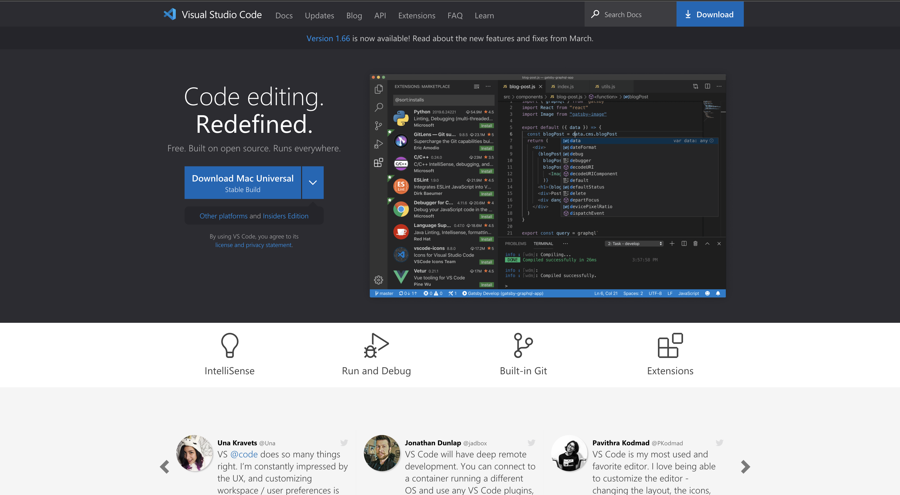
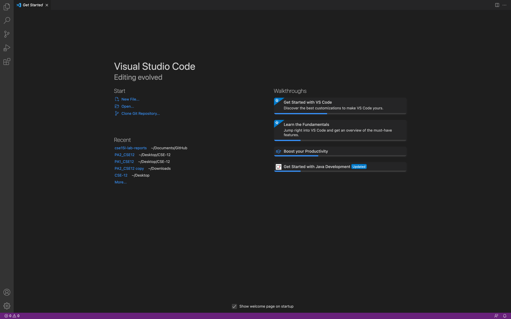
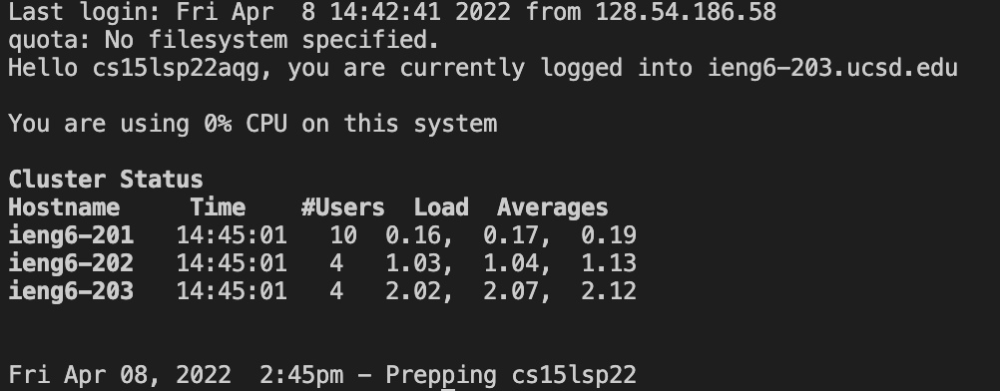
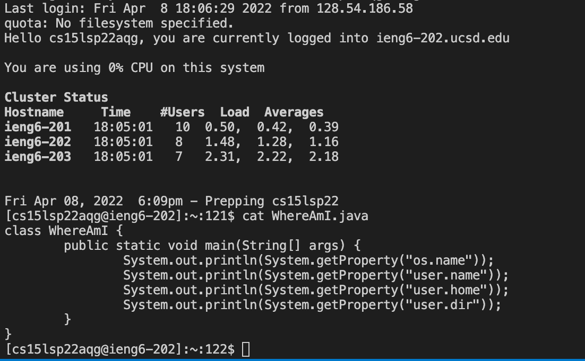
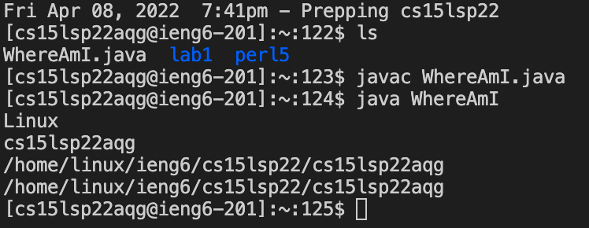

# Lab Report 1

## 1. Installing VSCode

* ### First start off by going to the [Visual Studio Code Website](https://code.visualstudio.com/).
* ### Then, as you can see from the image above, press the Download button. (It should automatically give you the download button for the Operating System you are using)
* ### Once the download is complete, go ahead and open the file to install the VSCode application.
* ### Once the installation is complete, you can now freely open the VSCode application. You should see something similar to the image below.


---
## 2. Remotely Connecting to SSH
*Disclaimer: I have only done the rest of this lab on MacOS, so I will only be going over the steps for MacOS.*

* ### As a student of UCSD, you will first need to go [here](https://sdacs.ucsd.edu/~icc/index.php) to find your course-specific account for CSE15L. 
* ### Once you have found out your course-specific account, open a terminal in VSCode and type in ```$ ssh cs15lsp22zz@ieng6.ucsd.edu``` where the ```zz``` will be subsituted with the letters of your course-specific account.
* ### Since it will most likely be your first time logging into this account, you will likely be shown some messages about the authencity of your host and an RSA key. Do not worry too much about these messages.
* ### If you are asked something along the lines of *Are you sure you want to continue connecting?*, simply type **yes**.
* ### After answering the question with yes, you will be prompted to put in your password, which should be the password you used to get your course-specific account. A successful login with your password will look something to similar to the image below.


---
## 3. Trying Some Commands
### Now that you have successfully logged on to the remote server, you can try using some Unix commands on both the server and your personal machine. Here are some examples of the commands you can try below.
* cd
* ls
* ls -a
* ls -lat
* touch helloworld.txt
* mkdir CSE-15L
* mv helloworld.txt ~/CSE-15L

*Note: To log out of your ssh, you can either press Ctrl + D, or type exit*.

---
## 4. Moving Files Over SSH Using SCP
### The scp command, also known as Secure Copy, allows you to securely copy files from one Unix/Linux **system** to another Unix/Linux **server**.
* ### From your personal machine, let's first create a java file to copy over, which we will call ```WhereAmI.java```. While you do not need to have java installed on your computer for what we are about to do, it would be great to have it for the file we will be creating.
* ### Now copy the following code and try compiling and running it using ```javac``` and ```java``` (if you have java installed):

```
class WhereAmI {
    public static void main(String[] args) {
        System.out.println(System.getProperty("os.name"));
        System.out.println(System.getProperty("user.name"));
        System.out.println(System.getProperty("user.home"));
        System.out.println(System.getProperty("user.dir"));
    }
}
```
*Note: You can type* ```$ vim WhereAmI.java``` *if you do not have an IDE and paste the code there. I use Shift + I to go into insert mode in order to paste the code, then press Esc and type :wq to save and exit*.

* ### Now that we have created the file that we will be copying over, we will now use the scp command to copy it over to our remote server's home directory. Type in ```$ scp WhereAmI.java cs15lsp22zz@ieng6.ucsd.edu:~/```
*Note: You will once again be prompted for a password since you are copying the file to your remote server*
* ### Now try logging back into your remote server and check if the correct file is there.

* ### Now try running ```javac``` and ```java``` for the ```WhereAmI.java``` file (java should be installed on the *server*, so you should be able to run it).

* ### As you can see, the getProperty functions we used for the Java file shows us the properties of the machine that is being used. When using the terminal on your client, you are given the properties of your personal machine. When running the terminal through ssh to your remote server, you are given the properties of the server in the CSE labs.

---
## 5. Setting an SSH Key 
