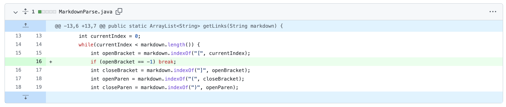
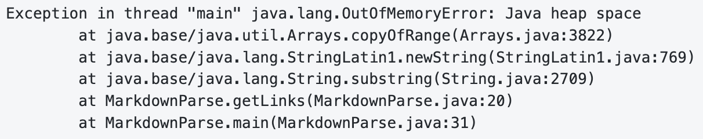
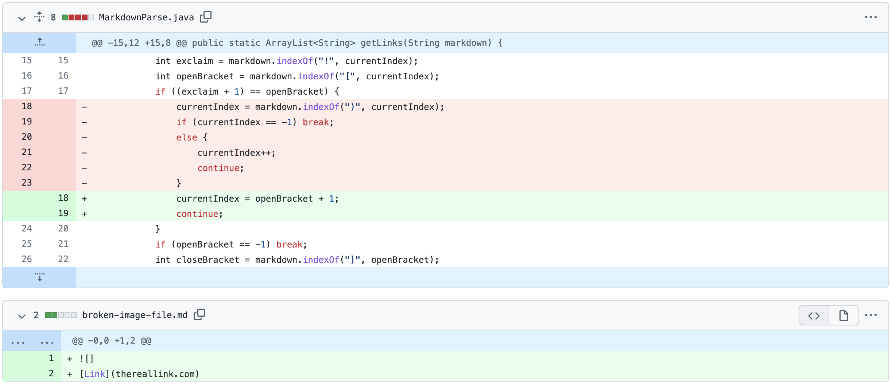
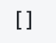
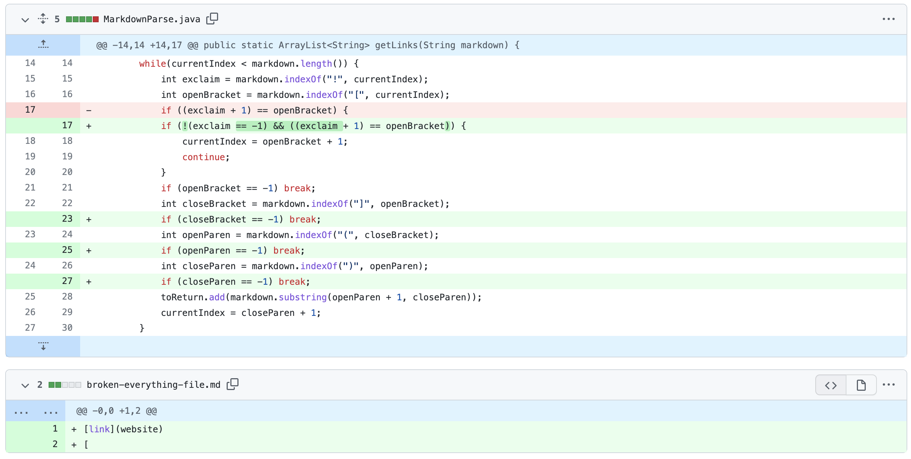
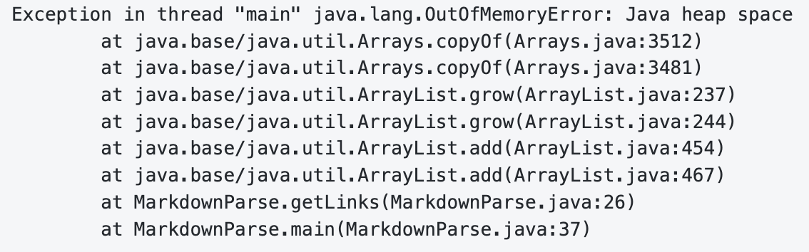

# Lab Report 2

## First Code Change

### Code difference



The [test file](Report-2-Markdown/test-file.md) that had the failure inducing input.

Symptom of *Failing-Inducing* input:

While hard to see in the markdown file, there is actually an *empty line* underneath the last link. Since the last line of the method makes the ```currentIndex``` variable only be index value larger than the closed parenthesis, the ```while``` loop's condition is not satisfied once the last closed parenthesis is reached and will continue the loop from the beginning. However, since there is no longer any open brackets, the ```openBracket``` variable and all succeeding variables after it that use the ```markdown.indexOf``` **method** will become ```-1```. Therefore, the value of ```currentIndex``` will once again become ```0``` by the end of the second loop and restart everything from the beginning, causing an ***infinite loop*** until there is no more memory left.

---
## Second Code Change
### Code difference

The [test file](Report-2-Markdown/broken-image-file.md) that had the failure inducing input.

Symptom of *Failing-Inducing* input:



As you can see from this image, the output was an *empty list*. However, we can see from the markdown file above that ```[thereallink.com]``` should've been the output. The code that I had deleted was initially used to spot for the use of an image markdown, which starts with an ```!```, and would skip to the closing parenthesis to ignore the image file link. However, in this test case, since we did not actually complete the image markdown procedure, the ```currentIndex``` would skip to the end of the link's closing parenthesis and not find the link to append to the ```ArrayList```.

---
## Third Code Change
### Code difference

The [test file](Report-2-Markdown/broken-everything-file.md) that had the failure inducing input.

Symptom of *Failing-Inducing* input:

This test case actually had _two_ symptoms, though the main symptom was the one you see above. The less noticeable symptom actually came from when the markdown file began with a link to a website. Due to my initial ```if ((exclaim + 1) == openBracket)``` condition, since no exclamation mark was found, it returned ```-1``` for my ```exclaim``` variable, and since ```exclaim + 1 = 0```, to which ```openBracket``` also equals ```0```, it would skip over the first link to find the next open bracket. As for the main symptom, we can see that the last line ends with an open bracket. That means my code would continue to look for a **closed bracket, open parenthesis, and closed parenthesis**. However, since those three do not exist in the markdown file, it will continuously look for them until there is no more heap space.