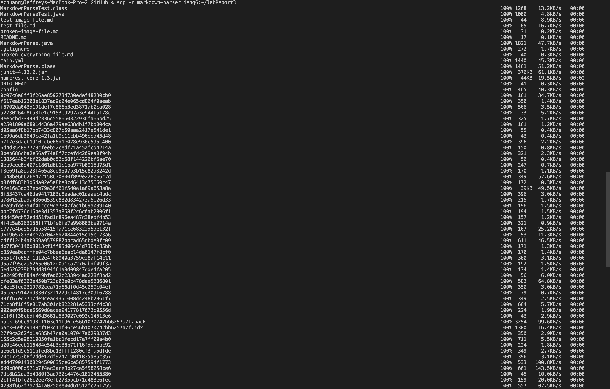

# Lab Report 3
## 1. Streamlining ssh configuration

Here we can see that in my ```.ssh``` directory, I have a file called ```config``` in which I put the name of the host of my ```ssh``` and my username to allow myself to ```ssh``` to my ieng6 remote server by simply typing ```ssh ieng6``` into the command line.

To edit my config file, I typed ```vim config``` in the ```~/.ssh``` directory and the VIM text-edit software will allow me to edit the config file.


In my case, I simply press ```Shift-I``` to go into ***Insert Mode*** and then I am able to type what you see above freely. To *save and exit*, you press ```Esc``` then type and enter ```:wq```.


Here you can see that I can now simply type and enter ```ssh ieng6``` to get into my ieng6 remote server.


Here you can see that I can ```scp``` a file to my remote server while only using my ```ieng6``` alias.

---
## 2. Setup GitHub Access from ieng6

Here is the ssh key for my ```ieng6``` on the GitHub website, which can be found by going to your account settings and going into the ```SSH and GPG keys``` section.


Here you can see in my ```~/.ssh``` directory that I have my ```ssh``` keys under the name ```id_ed25519``` for GitHub.


Here you can see that I was able to *stage, commit, and push* a changed file from my ```ieng6``` remote server. Here is the [link](https://github.com/ezh247467/markdown-parser/commit/e6512c49d8d4018e95b284519403a6dd6b46e732) to the commit in question.

---
## 3. Copy whole directories with ```scp -r```

*Since there seems to be way too much that had to be copied, my screenshot could not get all the details.*


Here you can see that I logged into my ```ieng6``` remote server and changed my directory to the copied ```markdown-parser```. From there, I used the ```Makefile``` that we learned how to make in *lab 6* to compile and run the tests much quicker.


*I split this part into two images. The first image shows me writing all the commands in one line along with the copying of the files to my ```ieng6``` and the second image shows the test being done in my ```ieng6``` server.*

