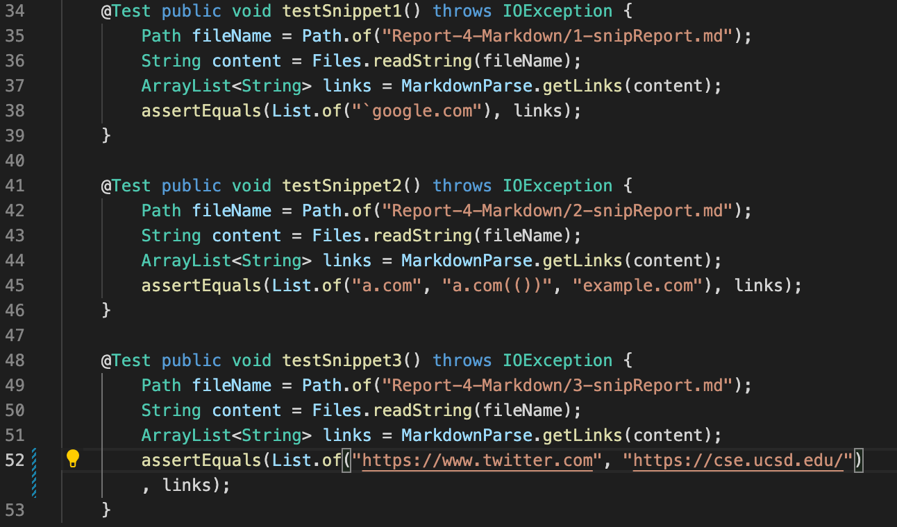
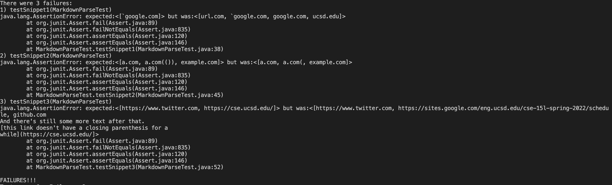
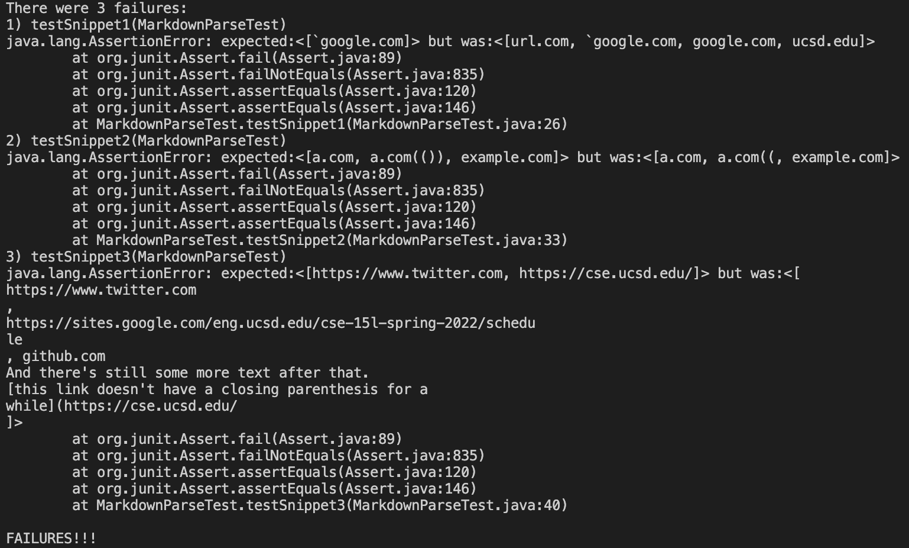
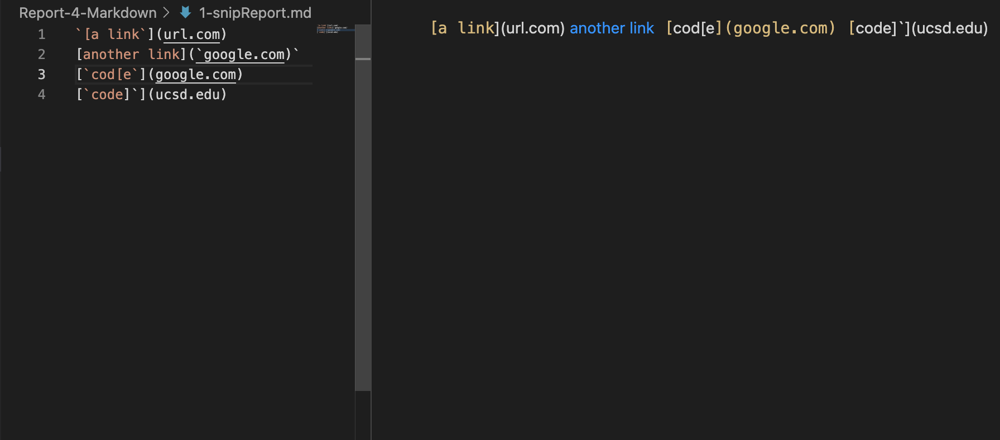
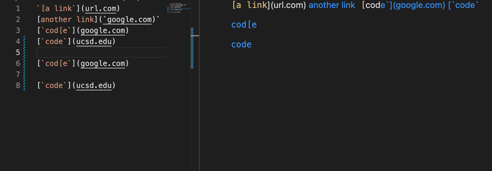
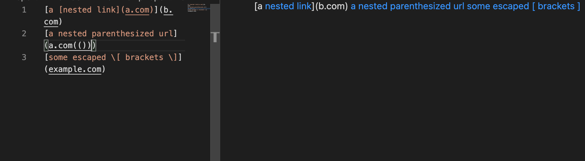
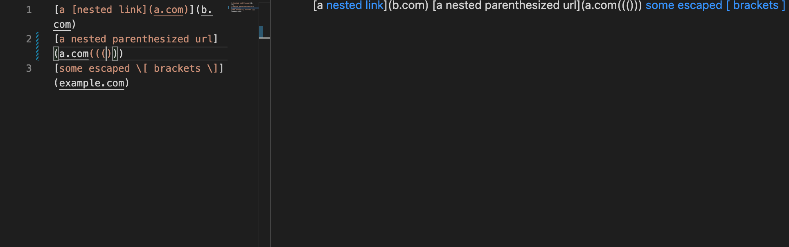

# Lab Report 4
Here are the GitHub repositories that are used for this lab report:
* [My Repository](https://github.com/ezh247467/markdown-parser)
* [Reviewed Repository](https://github.com/mikayladalton2/markdown-parser)
## Tester Code for the Provided Snippets

### Here is the output of those tests for my repository:

As you can see, all three tests had failed for my repository.
### Here is the output of those tests for the reviewed repository:

As you can see, all three tests had failed for the reviewed repository.

---

## Answering Questions for Code Snippet Changes
### 1. Snippet 1
I believe that there may have to be larger change in code in order to account for the backticks. This is because there could multiple different combinations of backticks that may cause the link to either work or not work for the markdown file. To show what I mean, we can look at the snippet 1 provided.

Here we can se that a backtick before a bracket can nullify the link as seen in line 1, and that a backtick after the open bracket and a backtick before the closed bracket can nullify the link as seen in line 3. However, that's not all, if I were to slightly modify the given snippet...

Here I modified the original snippet's line 4 by removing the closed bracket that came right before the backtick. This caused the link for *ucsd.edu* to be set to the words **e'](google.com)['code`**, which could unintentionally nullify legal links in other cases. I have also copied and pasted the exact same lines 3 and 4 to separate lines, separated with return lines. Here you can see that the backticks actually are ignored and have *google.com* and *ucsd.edu* as legal links. Just from seeing this, I can expect there to be a multitude of edge cases to account for and therefore will most likely have to make a very large code change if I want to solve this type of bug.

---

### 2. Snippet 2
I believe that a large code change would be necessary for this snippet of code. In the case of the brackets problem, the process of which I would make the change would be when my program identifies an open bracket, will check whether there is another open bracket before a closed bracket. If there is one, it will now use the second open bracket's index and check if there is another open bracket after it before a closed bracket. If there is still one, it will continue the process of checking for any open brackets before a closed bracket. Once it finally finds a closed bracket, it will then check if there is an open parenthesis following it, which would denote a potential link. If there is a closed bracket instead, it will then use the closed bracket's index and search for another open parenthsis to find a potential link. If there is an open parenthesis following the closed bracket, it will look for a closed parenthsis to denote the end of the link and add it to the list of links.

Similarly to the bracket problem, if there is a potential link, my program will have to check if there are any succeeding closed parenthesis other than just the first one it finds. If there are any, it will have to ignore the rest of the parenthesis until it finds the last one that ends the link. The problem is that there are edge cases where there will be lone closed parenthesis that could make the program mistake a link to not be a link and vice versa.

For example, as we can see from Snippet 2...

In line 2, *a.com(())* was a valid link. But if I were to slightly modify the snippet to look like this...

We can see that even the number of parenthesis can affect the validity of the link. This also means that we need to have code that keeps track of the number of parenthesis involved and how the different combinations of parenthesis can affect the validity of the link.

---

### 3. Snippet 3
While I am not completely sure if my solution is only a small change, I do know that the bug with this snippet has to do with certain conditions with the line breaks for each link markdown. I am only able to find *two cases* that sums up the behavior with the link markdown and line breaks. It appears that if the link right after the open parenthesis (with no line break in between them) then the closing parenthesis is only allowed one line break. If there is no text following the open parenthesis and instead has a line break with the link, then the closing parenthesis is also only allowed at most one line break. However, the link itself can only be at most one line break away from the open parenthesis. ***In other words, the closing parenthesis can only have at most one line break following the link, and the link can only have at most one line break following the open parenthesis.*** With this behavior in mind, it should not be too hard to edit the program for it to make sure there is only at most one line break in between the open parenthesis and the link, and between the link and the close parenthesis. Though there may be some trouble involved in having the program recognize a line break.