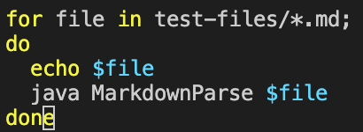
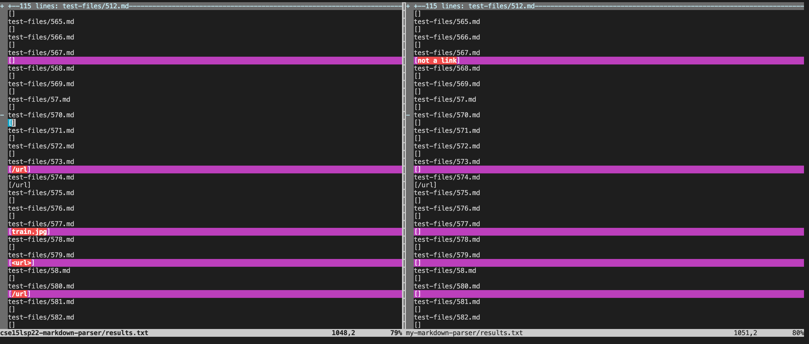
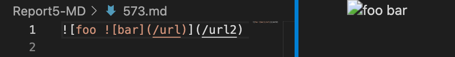
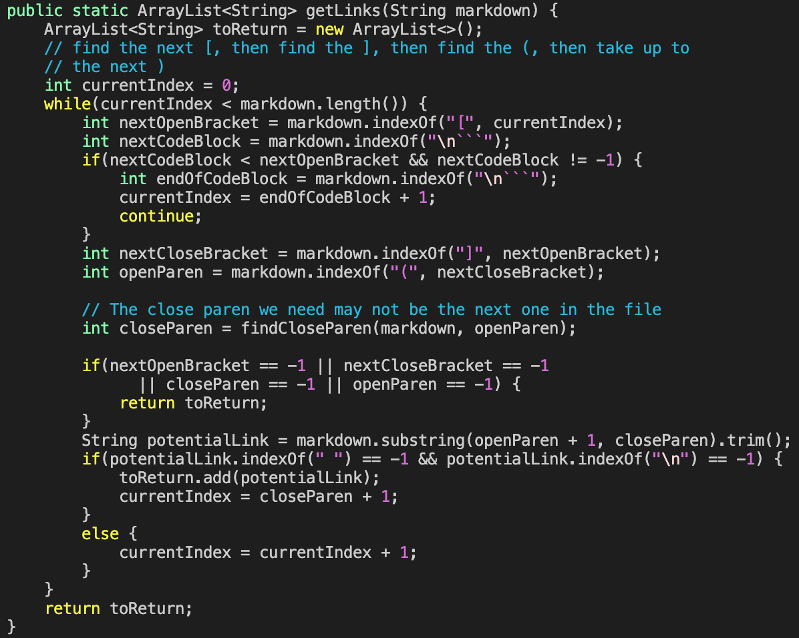
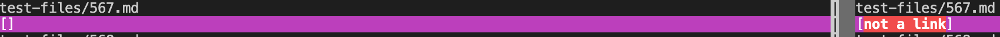
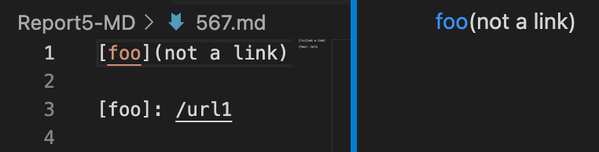
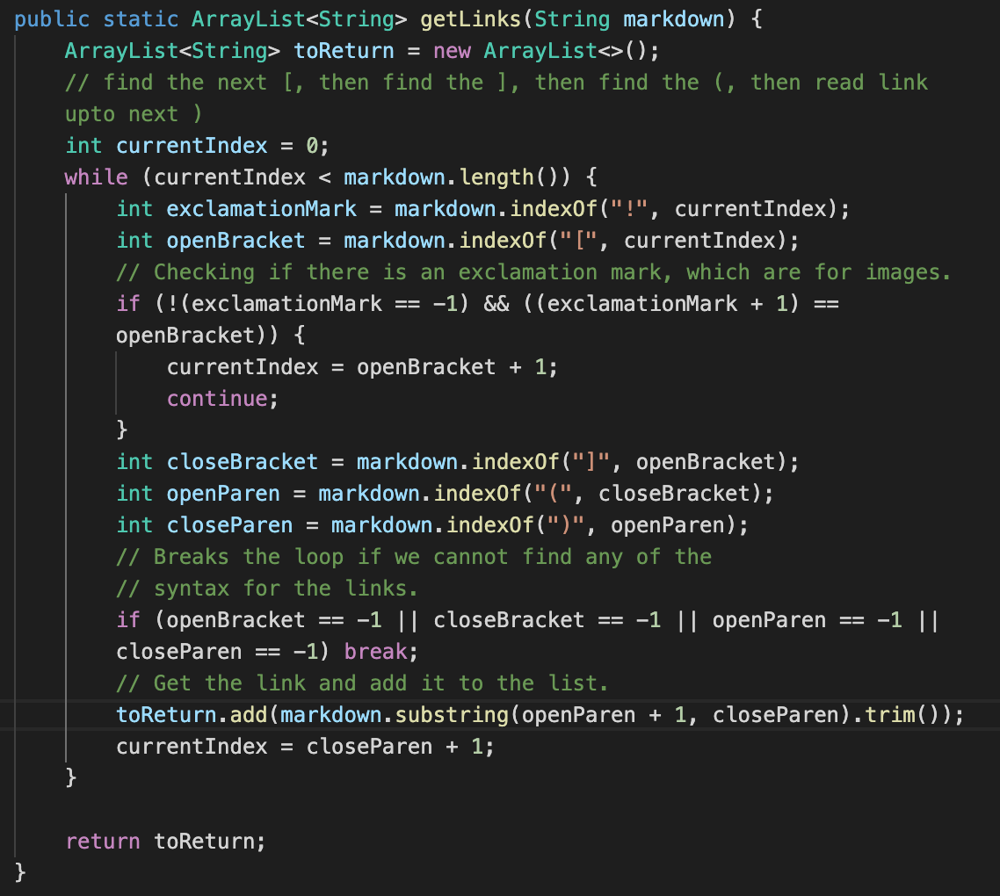

# Lab Report 5
## *How I find different test results*
---

Using the ```script.sh``` that was provided in the repository in lab 9, I can save the results of running every test file in the ```test-files``` directory by creating a new file that I called ```results.txt``` and putting the entire output of ``` bash script.sh``` into ```results.txt```. 


You can see that I added a line that would ```echo``` each file name to help differentiate which results belong with which test file. Then using the command ```bash script.sh > results.txt``` would create the ```results.txt``` file with the entire output of all the results of each test file in ```test-files```. I copied this ```script.sh``` to my own markdown-parser repository and did the exact same thing.

All I had to do now was to use the ```vimdiff``` command to show the different outputs of the ```results.txt``` of the given repository and the ```results.txt``` of my repository.


## 1. Test File 573.md

For this [test file](Report5-MD/573.md), the output for the given repository was ```[/url]``` while the output for my repository was ```[]```.


As you can see from how it looks, it appears that my output was correct in not getting any links. This is because this test file is using an image rather than a link, so it should be ignoring the "links" that would be found in between the parenthesis. 

As you can see here, the given repository's code never accounted for the ```!``` that may appear in front of the usual link markdown, making it an image markdown.

## 2. Test File 567.md

For this [test file](Report5-MD/567.md), the output for the given repository was ```[]``` while the output for my repository was ```[not a link]```.


As you can see here, it appears that both the given repository's output and my output were incorrect. The correct output would be ```[url1]```. This is because this type of link markdown is quite different than the standard link markdown, where the ```[foo]: /url1``` is used to make the linked text to ```foo```.

As we can see from my code, I failed to account for this type of link markdown, as I only wrote my code in the normal link markdown case in mind. I would have to create a fix that would look for ```:``` followed with a ```/``` in order to account for that kind of link markdown.